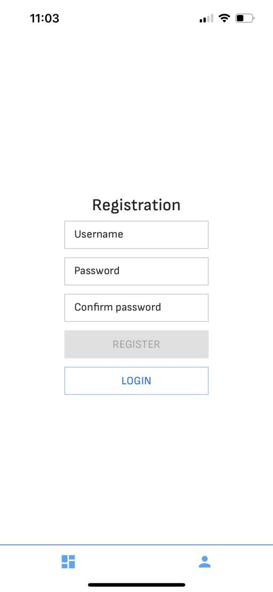
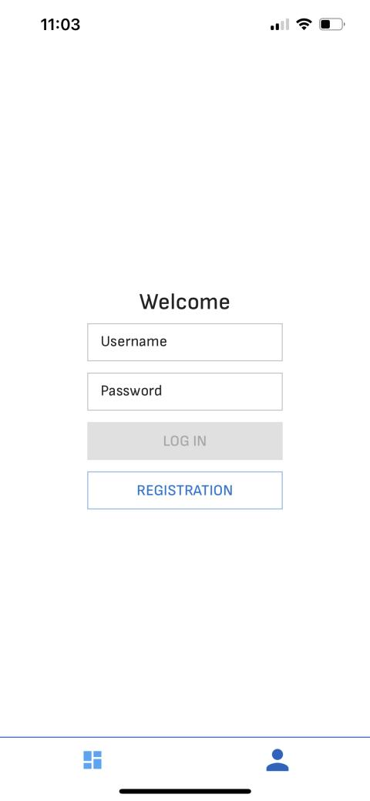
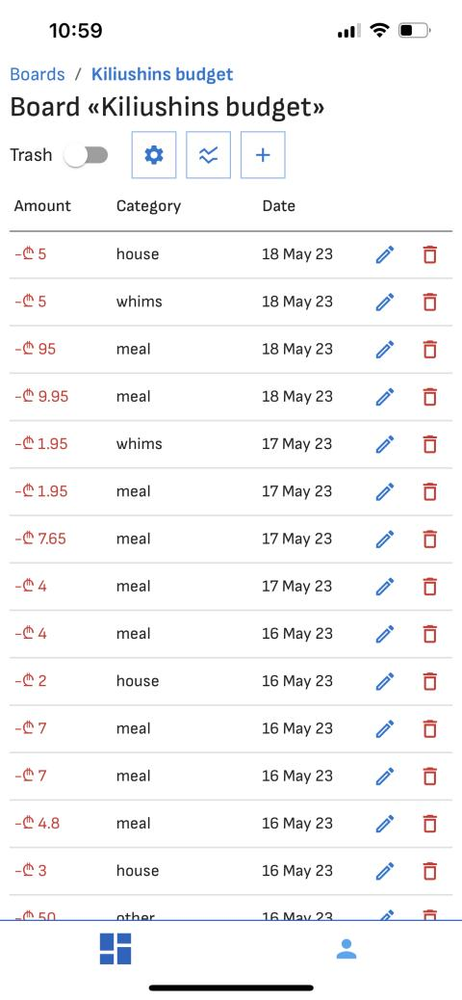
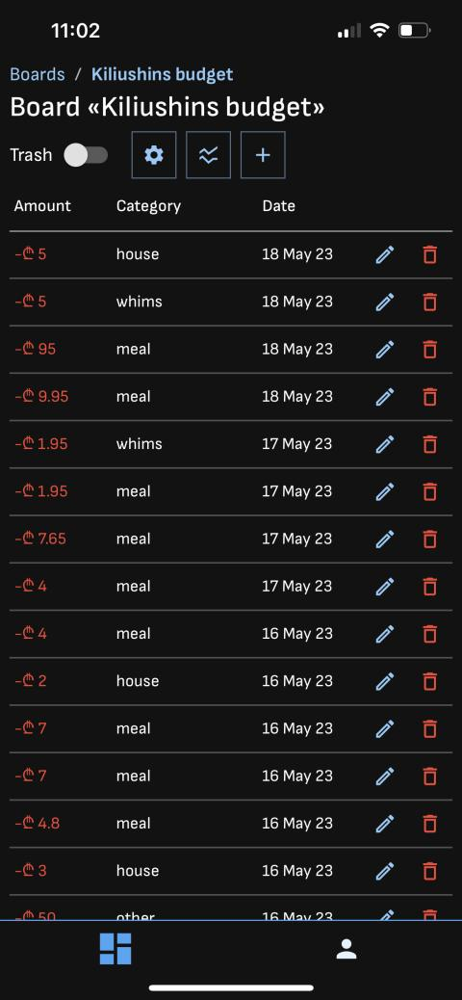
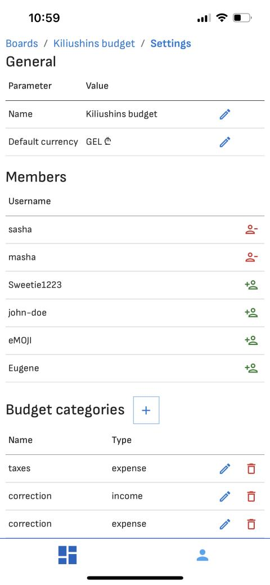
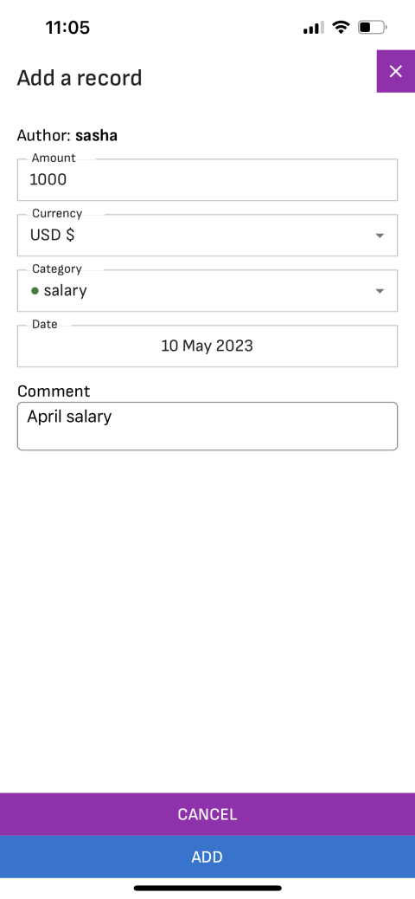
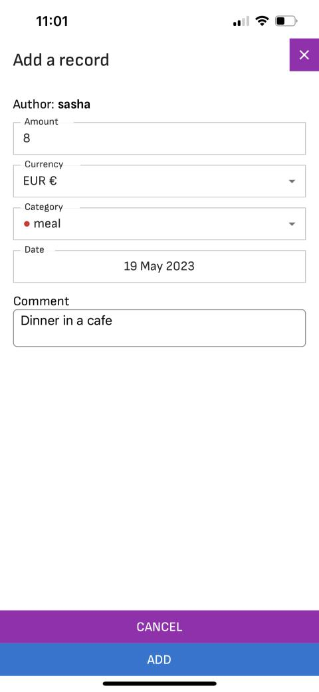
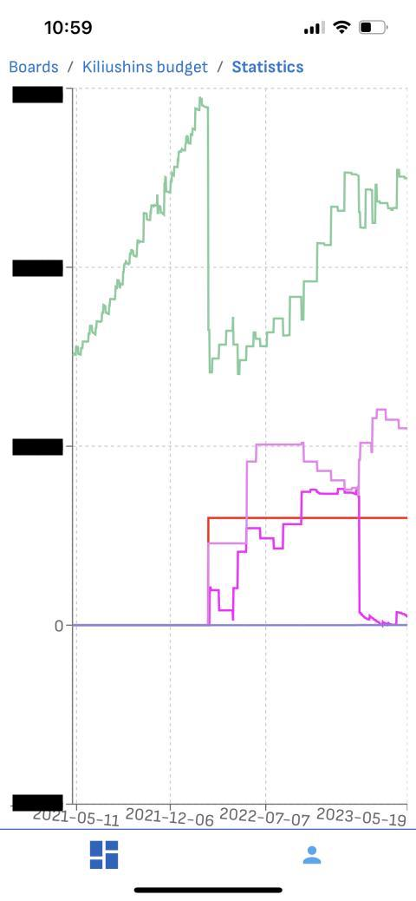
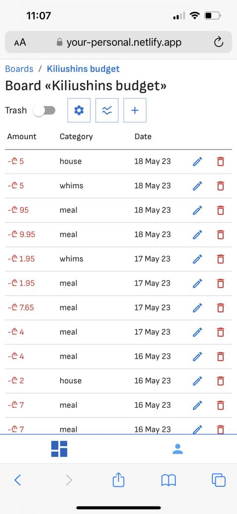
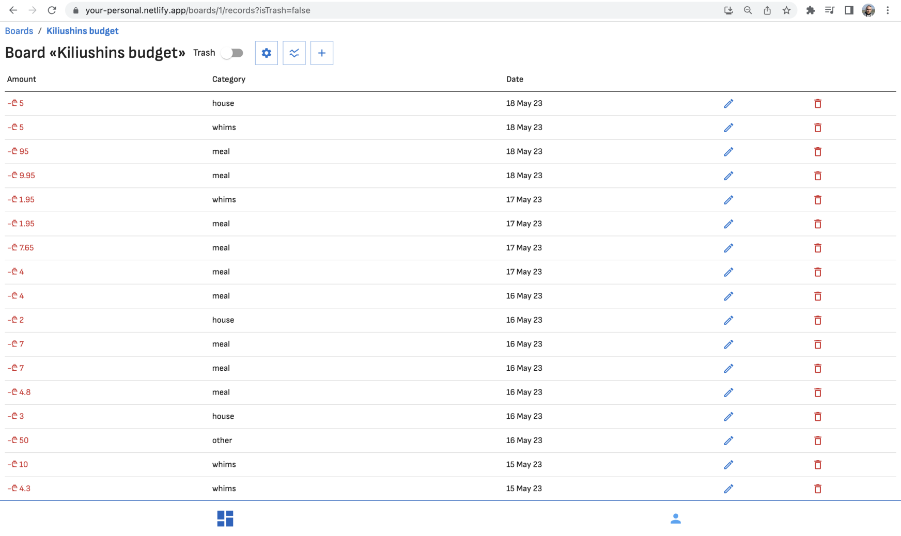

# Personal App Frontend

Personal App is an open-source budget tracking application that allows users to manage their incomes and expenses, track their budget, and analyze their financial statistics. The application provides features such as custom expense and income categories, different currencies, and shared budget boards for collaborative budget tracking.

## Frontend

The frontend of the Personal App provides a user-friendly interface for users to interact with their budgets, create budget boards, and visualize financial statistics. It is built using modern web technologies such as React and utilizes libraries like Material-UI for responsive and visually appealing UI components.

Key features of the Personal App frontend include:

1. **Adaptive Design:** The frontend is designed to be adaptive, providing a seamless experience across different devices, browsers and screen sizes (even 320px). Whether you're accessing the app from a desktop or a mobile device, you can comfortably manage your budgets.

1. **Progressive Web App (PWA):** The Personal App is available as a Progressive Web App, enabling users to install it as a standalone application on their mobile devices or PCs.

1. **Themes:** The app offers both dark and light themes, allowing users to customize their visual experience according to their preferences.

Feel free to check out the hosted frontend of the Personal App at [https://your-personal.netlify.app](https://your-personal.netlify.app) to experience the application firsthand.

## Running the frontend locally

Assuming that you already have already [launched backend locally](https://github.com/aleksandr-kiliushin/personal-app-server#running-the-backend-locally) at you machine, follow these steps to run frontend:

1. `git clone https://github.com/aleksandr-kiliushin/personal-app-frontend.git`
1. `cd personal-app-frontend`
1. `npm install`
1. `npm run dev`
1. `npm run test:component`
1. `npm run test:e2e`

## Backend

Please note that running the Personal app frontend locally in its full functionality requires setting up and running the backend server as well.

The [backend code repository](https://github.com/aleksandr-kiliushin/personal-app-server) includes detailed instructions on how to run the backend server locally. It provides step-by-step guidance on setting up the necessary dependencies and running the server on your machine.

## Screenshots

	</img>
	</img>
	</img>
	</img>
	</img>
	</img>
	</img>
	</img>
	</img>
	</img>

